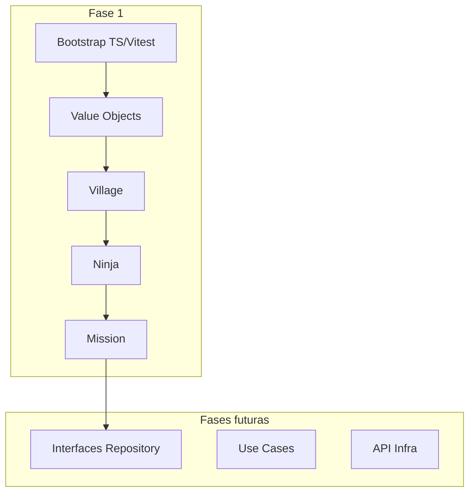

# Plano de implementação: Fase 1 — Entidades (Konoha Classic)

## Visão geral

A Fase 1 entrega a **fundação do domínio**: projeto TypeScript configurado, pastas conforme o [roadmap](file:///Users/joaovictornascimento/Documents/Obsidian%20Vault/Roadmaps/Roadmap%20Konoha-Classic-Clean-Architecture.md), value objects compartilhados e três entidades **ricas** (com regras e métodos), alinhadas às funcionalidades futuras (promoção, aceitar/completar missão, histórico).

O repositório está **greenfield** ([README.md](README.md) apenas; sem `package.json` nem `src/`). O repo de referência `folim` não está acessível publicamente — o modelo abaixo deriva do roadmap + API [Dattebayo](https://dattebayo-api.onrender.com) (`characters`, `villages`; **missões são domínio próprio**, não existem na API).



## Decisões de arquitetura

| Decisão | Escolha | Rationale |
|---------|---------|-----------|
| Stack | **Vite + TypeScript + Vitest** | Padrão moderno; React entra só na Fase 6 (presentation) |
| Estilo de entidade | **Rico** (confirmado) | `promote()`, `accept()`, `complete()` na entidade; Use Cases orquestram na Fase 3 |
| React na Fase 1 | **Não** | Roadmap: React somente em `presentation/` |
| IDs externos (API) | Campo opcional `externalId?: number` em `Ninja`/`Village` | Facilita mapeamento na Fase 4 sem acoplar infra ao domínio |
| Missões | Entidade pura de domínio | API não expõe missões; seed/mock virá depois na infra |

## Estrutura alvo (Fase 1)

```
src/
├── domain/
│   ├── entities/
│   │   ├── Village.ts
│   │   ├── Ninja.ts
│   │   └── Mission.ts
│   └── value-objects/
│       ├── NinjaRank.ts
│       └── MissionStatus.ts
└── main/                    # vazio ou index mínimo — factories na Fase 7
tests/
└── domain/
    ├── entities/
    └── value-objects/
```

Aliases TypeScript: `@/domain/*` → `src/domain/*` (facilita imports nas fases seguintes).

---

## Modelo de domínio (contrato das entidades)

### Value objects

- **`NinjaRank`**: `Genin` → `Chunin` → `Jonin` (ordem fixa para promoção)
- **`MissionStatus`**: `Available` | `InProgress` | `Completed`

### `Village`

| Campo | Tipo | Regras |
|-------|------|--------|
| `id` | `string` | UUID ou slug gerado no domínio |
| `name` | `string` | não vazio |
| `externalId` | `number?` | opcional (API `/villages`) |
| `ninjaIds` | `string[]` | somente leitura externamente |

**Métodos:** `registerNinja(ninjaId)`, `unregisterNinja(ninjaId)` — valida duplicidade.

### `Ninja`

| Campo | Tipo | Regras |
|-------|------|--------|
| `id` | `string` | |
| `name` | `string` | não vazio |
| `rank` | `NinjaRank` | default `Genin` |
| `villageId` | `string` | obrigatório |
| `externalId` | `number?` | opcional (API `/characters`) |
| `missionHistory` | `string[]` | IDs de missões **completadas** |

**Métodos:** `promote()` — só se rank atual permitir próximo nível; lança erro de domínio se já for `Jonin`. `recordCompletedMission(missionId)` — sem duplicar no histórico.

### `Mission`

| Campo | Tipo | Regras |
|-------|------|--------|
| `id` | `string` | |
| `title` | `string` | não vazio |
| `description` | `string` | opcional |
| `status` | `MissionStatus` | default `Available` |
| `assignedNinjaId` | `string?` | preenchido ao aceitar |
| `villageId` | `string` | vila da missão |

**Métodos:** `accept(ninjaId)` — só se `Available`; `complete()` — só se `InProgress` e ninja atribuído; `canBeAcceptedBy(ninjaId)` — helper para validações cruzadas na Fase 3.

Erros de domínio: classe simples `DomainError extends Error` em `src/domain/errors/DomainError.ts` (compartilhada pelas entidades).

---

## Lista de tarefas

### Task 0: Bootstrap do projeto

**Descrição:** Inicializar Vite (template `vanilla-ts` ou lib mode), Vitest, ESLint opcional mínimo, estrutura `src/domain` e `tests/domain`, scripts `build`, `test`, `typecheck`.

**Critérios de aceite:**
- [ ] `package.json` com `typescript`, `vite`, `vitest`
- [ ] `tsconfig.json` com `strict: true` e path alias `@/domain/*`
- [ ] Pastas `src/domain/{entities,value-objects,errors}` e `tests/domain/` criadas
- [ ] `npm run build` e `npm test` executam sem erro (suite vazia ou smoke test OK)

**Verificação:**
- [ ] `npm run build`
- [ ] `npm test`

**Dependências:** Nenhuma  
**Arquivos:** `package.json`, `vite.config.ts`, `vitest.config.ts`, `tsconfig.json`, `.gitignore`  
**Escopo:** M (~5 arquivos)

---

### Task 1: Value objects e erros de domínio

**Descrição:** Implementar `NinjaRank`, `MissionStatus` e `DomainError`, com helpers (`nextRank()`, transições válidas de status).

**Critérios de aceite:**
- [ ] `NinjaRank` expõe ordem e `getNext(): NinjaRank | null`
- [ ] `MissionStatus` documenta transições permitidas
- [ ] `DomainError` usável com mensagens claras
- [ ] Testes cobrem promoção máxima e transições inválidas de status

**Verificação:**
- [ ] `npm test -- tests/domain/value-objects`
- [ ] `npm run build`

**Dependências:** Task 0  
**Arquivos:** `src/domain/value-objects/*.ts`, `src/domain/errors/DomainError.ts`, testes espelhados  
**Escopo:** S

---

### Task 2: Entidade Village

**Descrição:** Classe `Village` com invariantes no construtor e registro de ninjas.

**Critérios de aceite:**
- [ ] Construtor rejeita `name` vazio
- [ ] `registerNinja` / `unregisterNinja` funcionam e impedem duplicata
- [ ] `externalId` opcional persistido na instância
- [ ] Testes unitários cobrem casos felizes e `DomainError`

**Verificação:**
- [ ] `npm test -- tests/domain/entities/Village`
- [ ] `npm run build`

**Dependências:** Task 1  
**Arquivos:** `src/domain/entities/Village.ts`, `tests/domain/entities/Village.test.ts`  
**Escopo:** S

---

### Task 3: Entidade Ninja

**Descrição:** Classe `Ninja` com rank inicial, vínculo à vila, `promote()` e histórico de missões.

**Critérios de aceite:**
- [ ] Default rank `Genin`; promoção Genin→Chunin→Jonin
- [ ] `promote()` lança `DomainError` em `Jonin`
- [ ] `recordCompletedMission` adiciona ID sem duplicar
- [ ] Testes cobrem cadeia completa de promoção e histórico

**Verificação:**
- [ ] `npm test -- tests/domain/entities/Ninja`
- [ ] `npm run build`

**Dependências:** Task 1, Task 2 (conceitual — `villageId` referenciado, sem acoplamento de classe)  
**Arquivos:** `src/domain/entities/Ninja.ts`, `tests/domain/entities/Ninja.test.ts`  
**Escopo:** S

---

### Task 4: Entidade Mission

**Descrição:** Classe `Mission` com fluxo `Available` → `InProgress` → `Completed`.

**Critérios de aceite:**
- [ ] `accept(ninjaId)` só em `Available`; define `assignedNinjaId` e status `InProgress`
- [ ] `complete()` só em `InProgress`; status `Completed`
- [ ] Chamadas inválidas lançam `DomainError`
- [ ] Testes cobrem fluxo completo e tentativas inválidas (ex.: aceitar duas vezes)

**Verificação:**
- [ ] `npm test -- tests/domain/entities/Mission`
- [ ] `npm run build`

**Dependências:** Task 1  
**Arquivos:** `src/domain/entities/Mission.ts`, `tests/domain/entities/Mission.test.ts`  
**Escopo:** S

---

### Task 5: Testes de integração leve entre entidades

**Descrição:** Um teste de cenário Hokage (sem Use Case): ninja aceita missão, completa, registra histórico — validando colaboração entre classes.

**Critérios de aceite:**
- [ ] Cenário: `Mission.accept` → `Mission.complete` → `Ninja.recordCompletedMission`
- [ ] Nenhuma dependência de React, Axios ou API
- [ ] Suite completa verde

**Verificação:**
- [ ] `npm test`
- [ ] `npm run build`

**Dependências:** Tasks 2, 3, 4  
**Arquivos:** `tests/domain/scenarios/hokage-mission-flow.test.ts`  
**Escopo:** XS

---

## Checkpoint: Fim da Fase 1

Após Tasks 0–5:

- [ ] `npm test` — 100% verde
- [ ] `npm run build` — sem erros TypeScript
- [ ] Roadmap Fase 1 marcável: Ninja, Mission, Village criados
- [ ] Revisão humana antes de iniciar [Fase 2 — Repositórios (interfaces)](file:///Users/joaovictornascimento/Documents/Obsidian%20Vault/Roadmaps/Roadmap%20Konoha-Classic-Clean-Architecture.md)

---

## Ordem de execução e paralelização

| Ordem | Task | Paralelizável com |
|-------|------|-------------------|
| 1 | Task 0 Bootstrap | — |
| 2 | Task 1 Value objects | — |
| 3 | Task 2 Village | — |
| 4 | Task 3 Ninja | Task 4 Mission (após Task 1) |
| 5 | Task 4 Mission | Task 3 Ninja |
| 6 | Task 5 Cenário integrado | — |

Tasks 3 e 4 podem ser feitas em paralelo após Task 1.

---

## Riscos e mitigações

| Risco | Impacto | Mitigação |
|-------|---------|-----------|
| API Dattebayo instável | Baixo na Fase 1 | `externalId` opcional; domínio independente |
| Regras duplicadas entidade vs Use Case | Médio | Documentar: entidade = invariantes; Use Case = orquestração + persistência (Fase 3) |
| Escopo creep (React/UI) | Médio | Não adicionar `presentation/` até Fase 6 |

---

## Comandos de referência (pós-bootstrap)

```bash
npm install
npm run build
npm test
npm test -- tests/domain/entities/Ninja.test.ts
```

---

## Fora do escopo da Fase 1

- Interfaces `NinjaRepository` / `MissionRepository` (Fase 2)
- Use Cases, Axios, controllers, páginas React (Fases 3–6)
- Injeção de dependência e cache (Fase 7)
