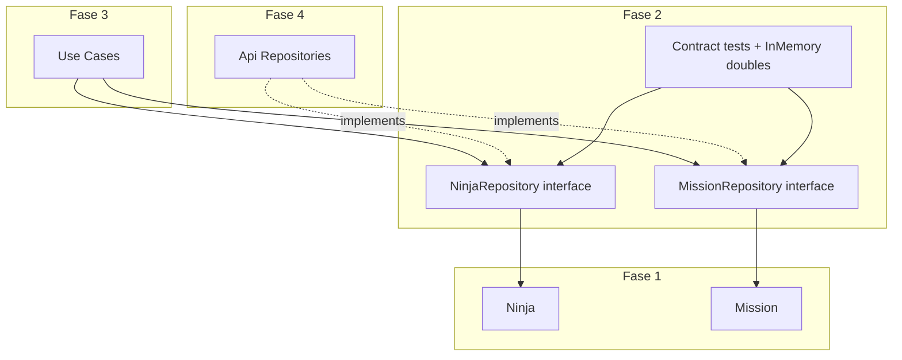

# Plano de implementação: Fase 2 — Repositórios (Konoha Classic)

## Visão geral

A Fase 2 introduz as **portas de saída** do domínio: interfaces TypeScript que definem como `Ninja` e `Mission` são lidos e persistidos, sem acoplar o domínio a HTTP, Axios ou React.

O roadmap exige **somente interfaces** — implementações concretas (`ApiNinjaRepository`, `ApiMissionRepository`) ficam para a Fase 4. Testes de contrato usam **doubles em memória** apenas em `tests/`, validando que os ports suportam os fluxos da Fase 3.



## Decisões de arquitetura

| Decisão | Escolha | Rationale |
|---------|---------|-----------|
| Forma do contrato | `interface` TypeScript | Ports em Clean Architecture; classes concretas em `infra/` |
| `VillageRepository` | Fora do escopo | Roadmap lista apenas `NinjaRepository` e `MissionRepository` |
| `findById` ausente | Retorna `null` | Use cases decidem erro na Fase 3 |
| `save` | `Promise<void>` | Persiste estado após `promote`, `accept`, `complete` |
| Filtro por vila | `findAll(villageId?: string)` | App focado na Vila da Folha; prepara listagens |
| Testes | Doubles em `tests/domain/repositories/` | Não são implementação de infra |

## Estrutura alvo

```
src/domain/repositories/
├── NinjaRepository.ts
├── MissionRepository.ts
└── index.ts
tests/domain/repositories/
├── InMemoryNinjaRepository.ts
├── InMemoryMissionRepository.ts
├── NinjaRepository.contract.test.ts
└── MissionRepository.contract.test.ts
```

## Contratos das interfaces

### NinjaRepository

```typescript
export interface NinjaRepository {
  findAll(villageId?: string): Promise<Ninja[]>;
  findById(id: string): Promise<Ninja | null>;
  save(ninja: Ninja): Promise<void>;
}
```

### MissionRepository

```typescript
export interface MissionRepository {
  findAll(villageId?: string): Promise<Mission[]>;
  findById(id: string): Promise<Mission | null>;
  save(mission: Mission): Promise<void>;
}
```

### Mapeamento para use cases (Fase 3)

| Use Case | Repositório | Métodos |
|----------|-------------|---------|
| `GetNinjasUseCase` | `NinjaRepository` | `findAll` |
| `GetMissionsUseCase` | `MissionRepository` | `findAll` |
| `PromoteNinjaUseCase` | `NinjaRepository` | `findById`, `save` |
| `AcceptMissionUseCase` | `MissionRepository` | `findById`, `save` |
| `CompleteMissionUseCase` | `MissionRepository`, `NinjaRepository` | `findById`, `save` |

## Lista de tarefas

- [x] Task 0: Estrutura `src/domain/repositories` e `tests/domain/repositories`
- [x] Task 1: Interface `NinjaRepository` + export no barrel
- [x] Task 2: Interface `MissionRepository` + export no barrel
- [x] Task 3: `InMemoryNinjaRepository` e `InMemoryMissionRepository` + testes de contrato
- [x] Checkpoint: `npm test` e `npm run build` verdes; reexport em `src/main/index.ts`

## Commits realizados (granular)

1. `feat: add NinjaRepository port interface`
2. `feat: add MissionRepository port interface`
3. `test: add in-memory repository contract tests`

## Verificação

- 36 testes passando ao final da fase (10 novos de contrato)
- Nenhum código em `src/infra/` ou `src/presentation/`

## Riscos e mitigações

| Risco | Impacto | Mitigação |
|-------|---------|-----------|
| Contrato incompleto para Fase 3 | Alto | Métodos validados contra use cases planejados |
| Confundir double de teste com infra | Médio | Doubles somente em `tests/` |
| API Dattebayo sem missões | Baixo | `MissionRepository` é contrato de domínio; seed na Fase 4 |

## Fora do escopo

- `ApiNinjaRepository`, `ApiMissionRepository`, `AxiosClient` (Fase 4)
- Use cases (Fase 3)
- Controllers e React (Fases 5–6)
- `VillageRepository`, cache, DI manual (Fase 7)
