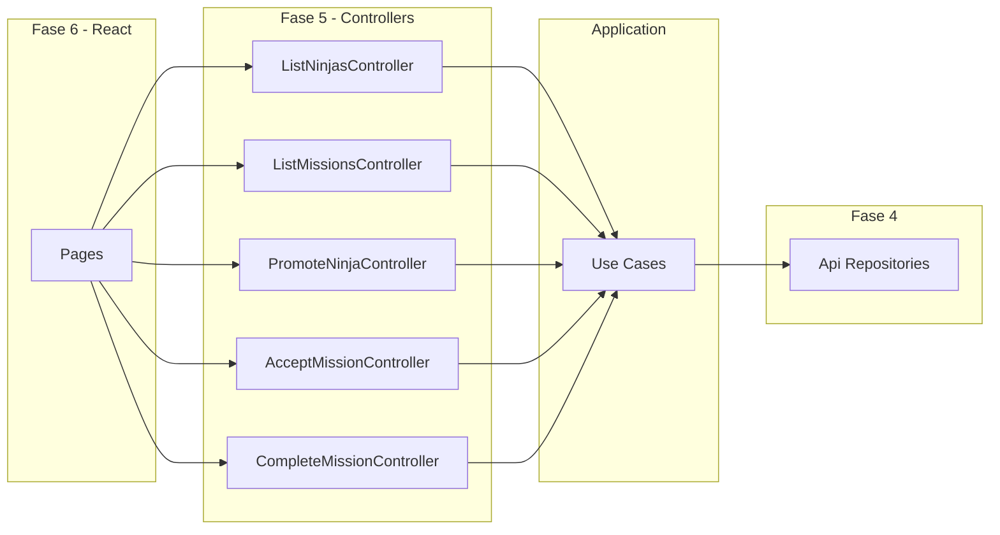

# Plano de implementação: Fase 5 — Controllers (Konoha Classic)

## Visão geral

A Fase 5 introduz a camada **presentation/controllers**: classes que adaptam a UI (Fase 6) aos **use cases** (Fase 3), sem lógica de negócio nem dependência de React. Controllers recebem use cases por construtor, chamam `execute()` e devolvem **view models** (DTOs estáveis para a apresentação).

Escopo confirmado: os **3 controllers do roadmap** mais **`ListMissionsController`** e **`AcceptMissionController`** para preparar as páginas da Fase 6.



## Decisões de arquitetura

| Decisão | Escolha | Rationale |
|---------|---------|-----------|
| Formato | Classes com `handle()` | Diferencia de `execute()` dos use cases |
| React na Fase 5 | **Não** | Roadmap: React só em `presentation/pages` e `components` (Fase 6) |
| Saída | **View models** | UI não consome entidades de domínio diretamente |
| Erros | **Propagar `DomainError`** | Páginas React tratam na Fase 6; controllers não engolem erros |
| Injeção | Constructor com use cases | Factories manuais na Fase 7 |
| Alias TS | `@/presentation/*` → `src/presentation/*` | Consistente com `@/domain` e `@/infra` |
| Wiring infra | **Não** nesta fase | Testes usam use cases + `InMemory*` / mocks; factories na Fase 7 |

## Estrutura alvo

```
src/presentation/
├── controllers/
│   ├── ListNinjasController.ts
│   ├── ListMissionsController.ts
│   ├── PromoteNinjaController.ts
│   ├── AcceptMissionController.ts
│   ├── CompleteMissionController.ts
│   └── index.ts
└── view-models/
    ├── NinjaViewModel.ts
    ├── MissionViewModel.ts
    └── mappers/
        ├── toNinjaViewModel.ts
        └── toMissionViewModel.ts
tests/presentation/
├── controllers/
│   └── *.test.ts
└── view-models/
    └── mappers.test.ts
```

## View models

### `NinjaViewModel`

```typescript
export interface NinjaViewModel {
  id: string;
  name: string;
  rank: string;
  villageId: string;
  externalId?: number;
  missionHistory: string[];
}
```

### `MissionViewModel`

```typescript
export interface MissionViewModel {
  id: string;
  title: string;
  description?: string;
  status: string;
  villageId: string;
  assignedNinjaId?: string;
}
```

### `CompleteMissionViewModel` (resposta composta)

```typescript
export interface CompleteMissionViewModel {
  mission: MissionViewModel;
  ninja: NinjaViewModel;
}
```

Mappers em `presentation/view-models/mappers/` convertem entidades → view models (sem regra de negócio).

## Contratos dos controllers

| Controller | Use case | `handle(input)` | Retorno |
|------------|----------|-----------------|---------|
| `ListNinjasController` | `GetNinjasUseCase` | `{ villageId?: string }` | `Promise<NinjaViewModel[]>` |
| `ListMissionsController` | `GetMissionsUseCase` | `{ villageId?: string }` | `Promise<MissionViewModel[]>` |
| `PromoteNinjaController` | `PromoteNinjaUseCase` | `{ ninjaId: string }` | `Promise<NinjaViewModel>` |
| `AcceptMissionController` | `AcceptMissionUseCase` | `{ missionId, ninjaId }` | `Promise<MissionViewModel>` |
| `CompleteMissionController` | `CompleteMissionUseCase` | `{ missionId: string }` | `Promise<CompleteMissionViewModel>` |

Exemplo de padrão:

```typescript
export class ListNinjasController {
  constructor(private readonly getNinjasUseCase: GetNinjasUseCase) {}

  async handle(input?: { villageId?: string }): Promise<NinjaViewModel[]> {
    const ninjas = await this.getNinjasUseCase.execute(input);
    return ninjas.map(toNinjaViewModel);
  }
}
```

---

## Lista de tarefas

### Task 0: Bootstrap `presentation/`

**Descrição:** Criar pastas, alias `@/presentation/*` em `tsconfig.json`, `vite.config.ts`, `vitest.config.ts`.

**Critérios de aceite:**
- [x] Alias configurado
- [x] `npm test` e `npm run build` verdes (71 testes atuais)

**Verificação:** `npm test` · `npm run build`  
**Escopo:** XS

---

### Task 1: View models e mappers

**Descrição:** Tipos de saída e funções `toNinjaViewModel` / `toMissionViewModel`.

**Critérios de aceite:**
- [x] Interfaces exportadas
- [x] Mappers mapeiam todos os campos usados na UI futura
- [x] Testes unitários dos mappers

**Verificação:** `npm test -- tests/presentation/view-models`  
**Dependências:** Task 0  
**Escopo:** S

---

### Task 2: `ListNinjasController` e `ListMissionsController`

**Descrição:** Controllers de leitura que delegam aos use cases e retornam listas de view models.

**Critérios de aceite:**
- [x] `handle` retorna arrays mapeados
- [x] Testes com use cases mockados ou `InMemory*Repository`
- [x] Filtro `villageId: 'konoha'` repassado ao use case

**Verificação:** `npm test -- tests/presentation/controllers/List`  
**Dependências:** Task 1  
**Escopo:** S

---

### Task 3: `PromoteNinjaController`

**Descrição:** Adapta promoção para a UI.

**Critérios de aceite:**
- [x] Retorna `NinjaViewModel` com rank atualizado
- [x] Teste de sucesso e propagação de `DomainError` (ninja inexistente / já Jonin)

**Verificação:** `npm test -- tests/presentation/controllers/PromoteNinja`  
**Dependências:** Task 1  
**Escopo:** S

---

### Task 4: `AcceptMissionController` e `CompleteMissionController`

**Descrição:** Controllers de fluxo de missão.

**Critérios de aceite:**
- [x] `AcceptMissionController` retorna `MissionViewModel` em progresso
- [x] `CompleteMissionController` retorna missão completa + ninja com histórico
- [x] Testes com repositórios em memória e use cases reais (integração leve presentation)

**Verificação:** `npm test -- tests/presentation/controllers/Accept` · `Complete`  
**Dependências:** Tasks 1–2  
**Escopo:** M

---

### Task 5: Barrel e checkpoint

**Descrição:** `src/presentation/controllers/index.ts`; marcar tarefas concluídas neste documento.

**Critérios de aceite:**
- [x] 5 controllers exportados
- [x] Domínio e infra **não** importam `presentation`
- [x] Suite completa verde (~85+ testes estimados)

**Verificação:** `npm test` · `npm run build`  
**Dependências:** Tasks 2–4  
**Escopo:** XS

---

## Checkpoint: Fim da Fase 5

- [x] 5 controllers + view models implementados
- [x] Sem React, sem factories em `main/`
- [x] Revisão humana antes da [Fase 6 — React](file:///Users/joaovictornascimento/Documents/Obsidian%20Vault/Roadmaps/Roadmap%20Konoha-Classic-Clean-Architecture.md)

---

## Ordem de execução

| Ordem | Task | Paralelizável |
|-------|------|----------------|
| 1 | Task 0 Bootstrap | — |
| 2 | Task 1 View models | — |
| 3 | Task 2 List controllers | Task 3 após Task 1 |
| 4 | Task 3 Promote | Com Task 2 |
| 5 | Task 4 Accept + Complete | Após Task 2 |
| 6 | Task 5 Barrel | Após 2–4 |

---

## Commits sugeridos (granular)

1. `chore: add presentation layer scaffolding and path alias`
2. `feat: add presentation view models and mappers`
3. `feat: add ListNinjasController and ListMissionsController`
4. `feat: add PromoteNinjaController`
5. `feat: add AcceptMissionController and CompleteMissionController`

---

## Riscos e mitigações

| Risco | Impacto | Mitigação |
|-------|---------|-----------|
| UI acoplada a entidades | Médio | View models obrigatórios na saída dos controllers |
| Duplicar regras nos controllers | Alto | Controllers só mapeiam; zero validação de negócio |
| Factories ausentes | Baixo na Fase 5 | Testes montam use cases + repos em memória |
| `AcceptMission` sem página na Fase 6 | Baixo | Controller pronto; página usa na Mission List |

---

## Fora do escopo da Fase 5

- Páginas e componentes React (Fase 6)
- Factories / DI manual em `main/factories` (Fase 7)
- Alterações em `ApiNinjaRepository` ou domínio
- Cache, Dark Mode, testes E2E browser
