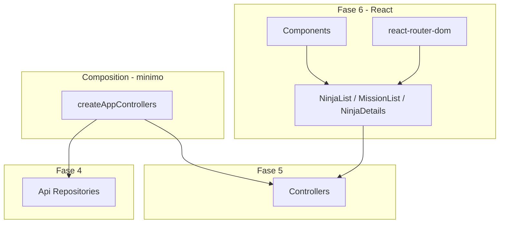

# Plano de implementação: Fase 6 — React (Konoha Classic)

## Visão geral

A Fase 6 entrega a **interface Hokage**: SPA React que consome **controllers** (Fase 5), conectados à infra real (Fase 4) via **composition root mínimo** em `src/main/` (refatorado na Fase 7).

O projeto hoje compila como **biblioteca** ([`vite.config.ts`](vite.config.ts)); esta fase migra o build para **aplicação SPA** com `index.html` e entrada React.



## Decisões de arquitetura

| Decisão | Escolha | Rationale |
|---------|---------|-----------|
| Stack UI | **React 19 + Vite SPA** | Roadmap: React só em `presentation/` |
| Roteamento | **react-router-dom** | `/ninjas`, `/missions`, `/ninjas/:ninjaId` |
| Wiring | **Composition root mínimo** em `src/main/composition.ts` | App funcional antes da Fase 7 |
| Vila padrão | `konoha` | Filtro em listagens |
| Estado async | `useEffect` + `useState` nas pages | Sem React Query nesta fase |
| Erros UI | Capturar `DomainError` e exibir mensagem | Controllers propagam erros |
| Estilo | **CSS modules** leve + layout Hokage | Dark Mode completo na Fase 7 |
| Testes UI | **@testing-library/react** + `jsdom` | Smoke das páginas com controllers mock |
| Build | SPA (`index.html`) | `npm run dev` para desenvolvimento |

## Estrutura alvo

```
index.html
src/
├── main/
│   ├── composition.ts          # wiring Api repos + controllers
│   └── bootstrap.tsx           # createRoot + RouterProvider
└── presentation/
    ├── App.tsx
    ├── routes.tsx
    ├── pages/
    │   ├── NinjaListPage.tsx
    │   ├── MissionListPage.tsx
    │   └── NinjaDetailsPage.tsx
    └── components/
        ├── AppLayout.tsx
        ├── NinjaCard.tsx
        ├── MissionCard.tsx
        ├── LoadingState.tsx
        └── ErrorAlert.tsx
tests/presentation/pages/
    ├── NinjaListPage.test.tsx
    ├── MissionListPage.test.tsx
    └── NinjaDetailsPage.test.tsx
```

## Rotas

| Rota | Página | Controller(s) |
|------|--------|-----------------|
| `/` | redirect → `/ninjas` | — |
| `/ninjas` | `NinjaListPage` | `ListNinjasController` |
| `/ninjas/:ninjaId` | `NinjaDetailsPage` | `ListNinjasController` + `PromoteNinjaController` |
| `/missions` | `MissionListPage` | `ListMissionsController`, `ListNinjasController`, `AcceptMissionController`, `CompleteMissionController` |

## Composition root (`createAppControllers`)

Monta a cadeia real (browser):

```typescript
// src/main/composition.ts (contrato)
export function createAppControllers() {
  const storage = new LocalStorageAdapter();
  const http = new AxiosClient();
  const ninjaRepository = new ApiNinjaRepository(http, storage);
  const missionRepository = new ApiMissionRepository(storage);
  // use cases → controllers
  return {
    listNinjas: new ListNinjasController(...),
    listMissions: new ListMissionsController(...),
    promoteNinja: new PromoteNinjaController(...),
    acceptMission: new AcceptMissionController(...),
    completeMission: new CompleteMissionController(...),
  };
}
```

Exportar tipo `AppControllers` para props/context.

## Comportamento das páginas

### `NinjaListPage`
- Carrega ninjas de Konoha ao montar (`listNinjas.handle({ villageId: 'konoha' })`)
- Lista com `NinjaCard` (nome, rank)
- Link para `/ninjas/:ninjaId`

### `NinjaDetailsPage`
- Lê `ninjaId` da rota
- Busca lista e encontra ninja (sem novo use case)
- Exibe rank, histórico de missões
- Botão **Promover** → `promoteNinja.handle` → atualiza UI
- Trata `DomainError` (ex.: já Jonin)

### `MissionListPage`
- Lista missões (`listMissions`)
- Carrega ninjas para select de aceite
- Por missão `Available`: select ninja + botão **Aceitar** → `acceptMission`
- Por missão `InProgress`: botão **Completar** → `completeMission`
- Feedback de loading/erro

## Lista de tarefas

### Task 0: Bootstrap React + SPA

**Descrição:** Instalar `react`, `react-dom`, `react-router-dom`, `@vitejs/plugin-react`, `@types/react`, `@types/react-dom`; configurar `index.html`, `vite` SPA, `tsconfig` `jsx: react-jsx`; scripts `dev` e ajuste de `build`.

**Critérios de aceite:**
- [x] `npm run dev` abre o app
- [x] `npm test` dos testes existentes continua verde
- [x] `jsx` configurado

**Verificação:** `npm run dev` · `npm test`  
**Escopo:** M

---

### Task 1: Composition root

**Descrição:** `src/main/composition.ts` + `bootstrap.tsx` com `AppControllers`.

**Critérios de aceite:**
- [x] Wiring completo domain → infra → use cases → controllers
- [x] `LocalStorageAdapter` no browser
- [x] Tipo exportado para injeção nas páginas

**Verificação:** `npm run typecheck`  
**Dependências:** Task 0  
**Escopo:** M

---

### Task 2: Layout, rotas e componentes base

**Descrição:** `App.tsx`, `routes.tsx`, `AppLayout`, `LoadingState`, `ErrorAlert`, CSS modules mínimo.

**Critérios de aceite:**
- [x] Rotas `/ninjas`, `/missions`, `/ninjas/:ninjaId`
- [x] Nav entre páginas
- [x] Layout com título "Konoha — Hokage Panel"

**Verificação:** `npm run dev` (smoke manual)  
**Dependências:** Task 0, Task 1  
**Escopo:** S

---

### Task 3: `NinjaListPage` + `NinjaCard`

**Descrição:** Listagem de ninjas com loading/erro e links para detalhes.

**Critérios de aceite:**
- [x] Consome `ListNinjasController` via context/props
- [x] Teste RTL com controller mockado

**Verificação:** `npm test -- tests/presentation/pages/NinjaList`  
**Dependências:** Task 2  
**Escopo:** S

---

### Task 4: `NinjaDetailsPage`

**Descrição:** Detalhe do ninja + promoção.

**Critérios de aceite:**
- [x] Exibe rank e `missionHistory`
- [x] Botão promover funciona e trata `DomainError`
- [x] Teste RTL (promote mock)

**Verificação:** `npm test -- tests/presentation/pages/NinjaDetails`  
**Dependências:** Task 3  
**Escopo:** S

---

### Task 5: `MissionListPage` + `MissionCard`

**Descrição:** Listagem, aceitar e completar missões.

**Critérios de aceite:**
- [x] Aceitar missão com ninja selecionado
- [x] Completar missão em progresso
- [x] Teste RTL para estados Available / InProgress

**Verificação:** `npm test -- tests/presentation/pages/MissionList`  
**Dependências:** Task 2  
**Escopo:** M

---

### Task 6: Checkpoint e documentação

**Descrição:** Marcar tarefas neste MD; `npm test` + `npm run build` verdes.

**Critérios de aceite:**
- [x] Fluxo manual: listar ninjas → detalhe → promover; listar missões → aceitar → completar
- [x] ~90+ testes no total
- [x] Sem import de React em `domain/` ou `infra/`

**Verificação:** `npm test` · `npm run build` · `npm run dev`  
**Dependências:** Tasks 3–5  
**Escopo:** XS

---

## Ordem de execução

| Ordem | Task |
|-------|------|
| 1 | Task 0 Bootstrap React |
| 2 | Task 1 Composition |
| 3 | Task 2 Layout + rotas |
| 4 | Task 3 NinjaListPage |
| 5 | Task 4 NinjaDetailsPage |
| 6 | Task 5 MissionListPage |
| 7 | Task 6 Checkpoint |

---

## Commits sugeridos (granular)

1. `chore: add React SPA tooling and dev server`
2. `feat: add composition root for app controllers`
3. `feat: add app layout and react-router routes`
4. `feat: add NinjaListPage and NinjaCard`
5. `feat: add NinjaDetailsPage with promote action`
6. `feat: add MissionListPage with accept and complete actions`

---

## Riscos e mitigações

| Risco | Impacto | Mitigação |
|-------|---------|-----------|
| Migração lib → SPA quebra build | Alto | `build` gera `dist/` SPA; domain continua importado internamente |
| API lenta na primeira carga | Médio | Loading states; cache na Fase 7 |
| Detalhe do ninja via lista | Baixo | Aceitável no MVP; use case dedicado depois se necessário |
| CORS na API | Médio | Dattebayo já usada no browser; validar em `npm run dev` |

---

## Fora do escopo da Fase 6

- Factories formais em `main/factories/` (Fase 7)
- Dark Mode Hokage Edition (Fase 7)
- Testes E2E browser automatizados (opcional pós-MVP)
- Alterações em entidades ou use cases
