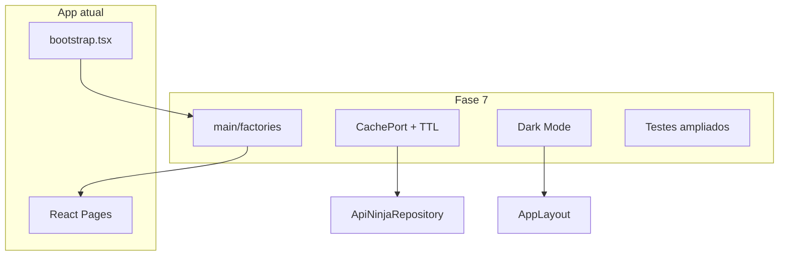

# Plano de implementação: Fase 7 — Extras (Konoha Classic)

## Visão geral

A Fase 7 consolida o projeto para **produção local**: factories de injeção de dependência manual, reforço de testes nas camadas de aplicação e infra, **cache** para reduzir chamadas à API Dattebayo e **Dark Mode Hokage Edition** na UI.

Estado atual: [`src/main/composition.ts`](src/main/composition.ts) concentra todo o wiring; use cases e repositórios Api **já possuem testes** em `tests/domain/usecases/` e `tests/infra/repositories/` — esta fase **refatora DI**, **amplia** cenários críticos e adiciona cache + tema.



## Decisões de arquitetura

| Decisão | Escolha | Rationale |
|---------|---------|-----------|
| DI | Factories em `src/main/factories/` | Roadmap; separação por camada |
| `composition.ts` | Reexport fino ou removido | `createAppControllers` vive em `factories/index.ts` |
| Cache | `CachePort` em memória + TTL | Só para leitura de `/characters` (missões já são locais) |
| TTL padrão | 5 minutos | Balanceio API vs dados frescos |
| Invalidação cache | Após `save` em `ApiNinjaRepository` | Overrides locais devem refletir sem stale total |
| Dark Mode | CSS variables + `data-theme` | Sem lib de UI; persistência em `localStorage` |
| Testes use cases | Revisar lacunas + cenários integrados | Arquivos já existem; evitar duplicar testes triviais |
| Testes repositories | Ampliar Api + testes de cache | Foco em comportamento real da infra |

## Estrutura alvo

```
src/main/
├── factories/
│   ├── createStorage.ts
│   ├── createRepositories.ts
│   ├── createUseCases.ts
│   ├── createControllers.ts
│   └── index.ts              # export createAppControllers()
├── bootstrap.tsx
└── index.ts                  # exports domínio (mantido)
src/infra/
├── cache/
│   ├── CachePort.ts
│   └── InMemoryCacheAdapter.ts
└── repositories/
    └── ApiNinjaRepository.ts # usa cache em fetchKonohaCharacters
src/presentation/
├── components/
│   └── ThemeToggle.tsx
├── context/
│   └── ThemeContext.tsx
└── styles/
    ├── global.css            # variables light/dark
    └── themes.css
tests/
├── main/factories/
│   └── createAppControllers.test.ts
├── domain/usecases/          # cenários adicionais se faltarem
└── infra/cache/
    └── InMemoryCacheAdapter.test.ts
```

---

## Lista de tarefas

### Task 0: Factories — injeção de dependência manual

**Descrição:** Extrair wiring de [`composition.ts`](src/main/composition.ts) para factories por camada.

**Critérios de aceite:**
- [x] `createStorage()` → `LocalStorageAdapter`
- [x] `createRepositories(storage, http?)` → `ApiNinjaRepository`, `ApiMissionRepository`
- [x] `createUseCases(repos)` → todos os use cases
- [x] `createControllers(useCases)` → todos os controllers
- [x] `createAppControllers()` em `factories/index.ts` compõe tudo
- [x] `bootstrap.tsx` importa apenas de `factories`
- [x] Teste smoke: objeto retornado tem 5 controllers

**Verificação:** `npm test -- tests/main/factories` · `npm run build`  
**Escopo:** M

---

### Task 1: Cache local para ninjas (API)

**Descrição:** `CachePort` + `InMemoryCacheAdapter` com TTL; `ApiNinjaRepository` cacheia resultado de `fetchKonohaCharacters`.

**Critérios de aceite:**
- [x] Segunda chamada `findAll` dentro do TTL não dispara novo `httpClient.get`
- [x] `save()` invalida cache de personagens (ou chave específica)
- [x] Testes unitários do adapter e do repositório com mock HTTP

**Verificação:** `npm test -- tests/infra/cache` · `tests/infra/repositories/ApiNinja`  
**Dependências:** Task 0 (opcional)  
**Escopo:** M

---

### Task 2: Testes dos use cases (reforço)

**Descrição:** Auditar cobertura existente em `tests/domain/usecases/` e adicionar apenas cenários **ainda não cobertos**.

**Estado atual (já existem):**
- `GetNinjasUseCase`, `GetMissionsUseCase`, `PromoteNinjaUseCase`, `AcceptMissionUseCase`, `CompleteMissionUseCase`

**Critérios de aceite:**
- [x] Cenário integrado: Accept → Complete com repositórios em memória (use case level)
- [x] Documentar no plano/checklist que cobertura base está OK
- [x] Nenhuma regressão na suite

**Verificação:** `npm test -- tests/domain/usecases`  
**Escopo:** S

---

### Task 3: Testes dos repositories (reforço)

**Descrição:** Ampliar testes de `ApiNinjaRepository` e `ApiMissionRepository` além dos casos atuais.

**Critérios de aceite:**
- [x] `ApiMissionRepository`: fluxo seed → accept → save → reload
- [x] `ApiNinjaRepository`: paginação mockada (múltiplas páginas) se aplicável
- [x] Testes não dependem de rede real

**Verificação:** `npm test -- tests/infra/repositories`  
**Escopo:** S

---

### Task 4: Dark Mode Hokage Edition

**Descrição:** Tema escuro com identidade Konoha (verde/âmbar), toggle no header, preferência persistida.

**Critérios de aceite:**
- [x] CSS variables para `background`, `text`, `card`, `header`, `accent`
- [x] `ThemeProvider` + `ThemeToggle` em `AppLayout`
- [x] Chave `konoha:theme` em `localStorage` (`light` | `dark`)
- [x] Contraste legível em cards e botões
- [x] Teste RTL: toggle altera `data-theme` no `document.documentElement`

**Verificação:** `npm test -- tests/presentation/components/ThemeToggle` · `npm run dev` (smoke visual)  
**Escopo:** M

---

### Task 5: Checkpoint e documentação

**Descrição:** Atualizar este MD com tarefas concluídas; README com comandos `dev`, `test`, `build`.

**Critérios de aceite:**
- [x] `npm test` verde (~95+ testes)
- [x] `npm run build` OK
- [x] README mínimo com arquitetura em 5 linhas + como rodar

**Verificação:** `npm test` · `npm run build`  
**Dependências:** Tasks 0–4  
**Escopo:** XS

---

## Ordem de execução

| Ordem | Task | Paralelizável |
|-------|------|----------------|
| 1 | Task 0 Factories | — |
| 2 | Task 1 Cache | Após Task 0 |
| 3 | Task 2 Use cases tests | Com Task 3 |
| 4 | Task 3 Repository tests | Com Task 2 |
| 5 | Task 4 Dark Mode | Após Task 0 |
| 6 | Task 5 Checkpoint | Após todas |

Tasks 2, 3 e 4 podem rodar em paralelo após Task 0.

---

## Commits sugeridos (granular)

1. `refactor: extract manual DI factories in main/factories`
2. `feat: add in-memory cache for Dattebayo ninja fetch`
3. `test: strengthen use case and repository test coverage`
4. `feat: add Hokage dark mode with theme toggle`
5. `docs: update README and phase 7 plan checklist`

---

## Riscos e mitigações

| Risco | Impacto | Mitigação |
|-------|---------|-----------|
| Cache stale após promote | Médio | Invalidar cache no `save` do ninja |
| Refactor DI quebra bootstrap | Alto | Teste smoke de factories |
| Dark mode inconsistente | Baixo | Variables centralizadas em `global.css` |
| Duplicar testes existentes | Baixo | Auditar antes de escrever novos |

---

## Fora do escopo da Fase 7

- Backend próprio ou autenticação
- React Query / state manager global
- Testes E2E Playwright (opcional futuro)
- `VillageRepository` ou novas features de negócio
- Publicação/deploy (Vercel/Netlify) — pode ser follow-up

---

## Checkpoint: Projeto Konoha MVP completo

Após Fase 7, o roadmap principal está concluído:

- [x] Fase 1 Entidades
- [x] Fase 2 Repositórios (ports)
- [x] Fase 3 Use Cases
- [x] Fase 4 Infra (Api)
- [x] Fase 5 Controllers
- [x] Fase 6 React Pages
- [x] Fase 7 Extras (este plano)
